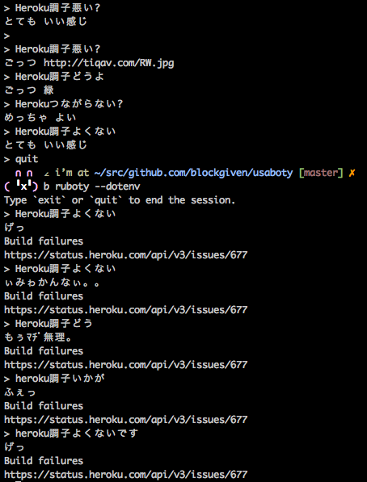

# Ruboty::HerokuStatus

Ruboty plugin for ちょっとHerokuの様子見てくる。



## Installation

Add this line to your application's Gemfile:

```ruby
gem 'ruboty-heroku_status'
```

And then execute:

    $ bundle

Or install it yourself as:

    $ gem install ruboty-heroku_status

## Usage

    Herokuの調子どう?

## Contributing

1. Fork it ( https://github.com/blockgiven/ruboty-heroku_status/fork )
2. Create your feature branch (`git checkout -b my-new-feature`)
3. Commit your changes (`git commit -am 'Add some feature'`)
4. Push to the branch (`git push origin my-new-feature`)
5. Create a new Pull Request
